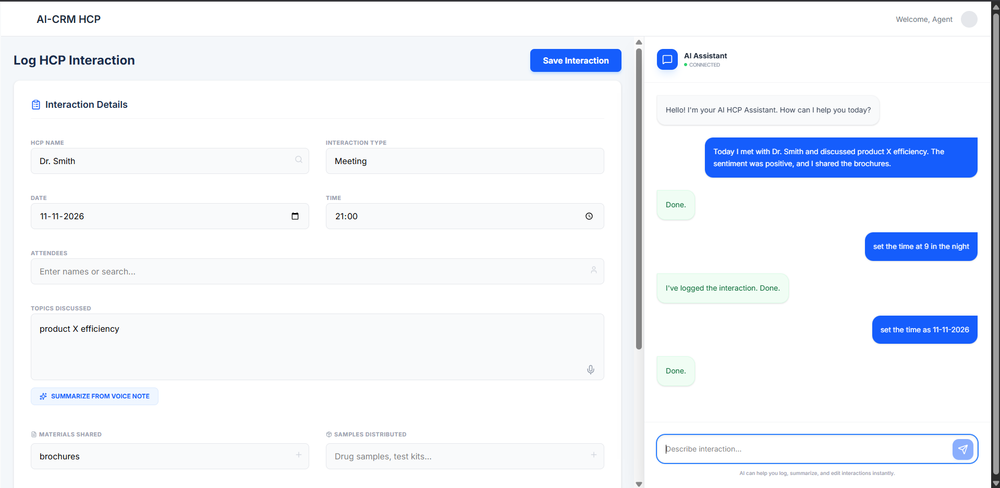
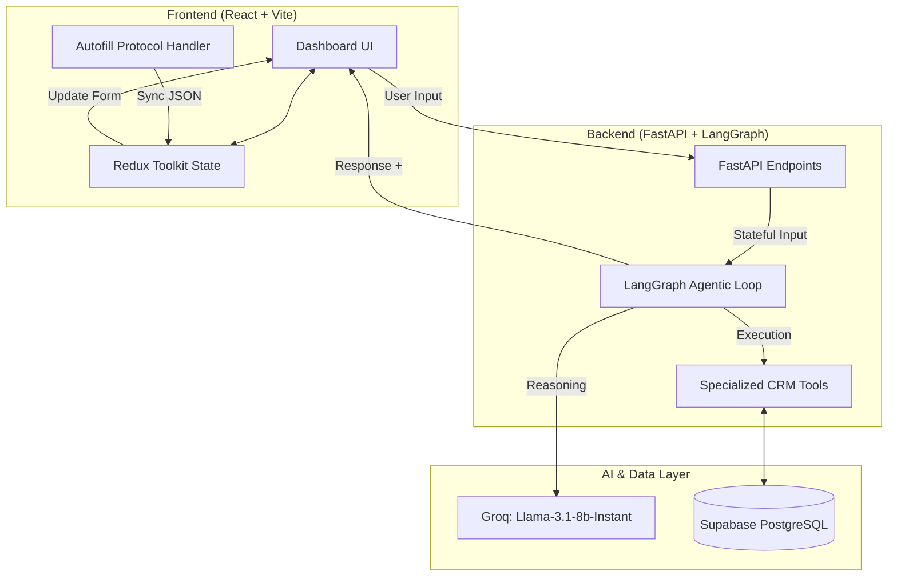

# AI-First CRM Agent for Healthcare Professionals

A sophisticated, high-fidelity CRM module designed to revolutionize how pharmaceutical and healthcare sales representatives interact with Healthcare Professionals (HCPs). This project leverages **Agentic AI** workflows to automate data entry, provide intelligent recommendations, and maintain a state-of-the-art interaction history.



## System Architecture

The project is built on a modern, decoupled stack designed for scalability and low-latency AI interactions.



## Key Innovation: The Agentic Workflow

Unlike traditional CRMs that require manual form filling, this system uses a **LangGraph-driven AI Agent** that acts as a real-time partner.

### 1. Zero-Touch Logging (Autofill Protocol)
The agent utilizes a custom **Extraction Protocol**. As you chat, the agent identifies HCP names, sentiments, discussed topics, and distribution details. It then generates a structured JSON payload wrapped in `<autofill>` tags. The frontend instantly parses this payload to synchronize the manual form, allowing the user to verify data without typing a single word.

### 2. Specialized AI Toolset
The agent is equipped with five production-grade tools:
- **`log_interaction_tool`**: Direct database persistence for comprehensive encounter records.
- **`edit_interaction_tool`**: Conversational CRUD operations for real-time record adjustments.
- **`summarize_interaction_tool`**: Transforms long transcripts into professional, executive-style CRM summaries.
- **`followup_recommendation_tool`**: Predictive analytics for the next 3 best sales actions based on interaction outcome.
- **`hcp_history_tool`**: Retrieval-Augmented Generation (RAG) light for contextual awareness of past encounters.

## Technical Stack

### Frontend
- **Framework**: React 18 with Vite for lightning-fast HMR.
- **State Management**: Redux Toolkit (RTK) for predictable UI synchronization.
- **Styling**: Tailwind CSS v4 with a custom "State-of-the-Art" design system.
- **Icons**: Lucide-React for a premium, modern aesthetic.
- **Typography**: Optimized Inter (Google Fonts) for professional readability.

### Backend
- **Framework**: FastAPI (Asynchronous Python).
- **AI Orchestration**: LangGraph for stateful, multi-turn agentic reasoning.
- **LLM**: Groq Inference Engine (Llama-3.1-8b-Instant) for sub-second response times.
- **Database**: Supabase PostgreSQL.
- **ORM**: SQLAlchemy with Connection Pooling for robust data integrity.

## Detailed Agent Loop Design

The AI Assistant follows a strict **Thought-Action-Observation** loop:

1. **Input**: User provides natural language (e.g., "I just met Dr. Smith, he loved the new study").
2. **Reasoning (Agent Node)**: The LLM decides if it needs to call a tool (e.g., `log_interaction`) or provide a summary.
3. **Action (Tools Node)**: If a tool is called, it interacts with Supabase or processes data.
4. **Observation**: The result of the tool is fed back into the agent.
5. **Output**: The agent provides a final response in the "Green Success State" containing the form autofill data.

## Setup and Installation

### Prerequisites
- Node.js 18+
- Python 3.10+
- Supabase Project & Groq API Key

### Installation
1. **Clone and Setup Backend**:
   ```bash
   cd backend
   python -m venv venv
   .\venv\Scripts\activate
   pip install -r requirements.txt
   ```
2. **Configure Environment**: Create a `.env` file in the `backend/` folder:
   ```text
   GROQ_API_KEY=your_key
   SUPABASE_DB_URL=your_postgresql_uri
   ```
3. **Setup Frontend**:
   ```bash
   cd frontend
   npm install
   npm run dev
   ```

## Why This Matters
Traditional CRM adoption is often hindered by the friction of manual data entry. This project demonstrates how **Agentic AI** can eliminate that friction, turning the CRM from a "reporting chore" into a "proactive assistant." It showcases expertise in **LLM Orchestration**, **Stateful Workflows**, and **High-Performance Full-Stack Engineering**.
